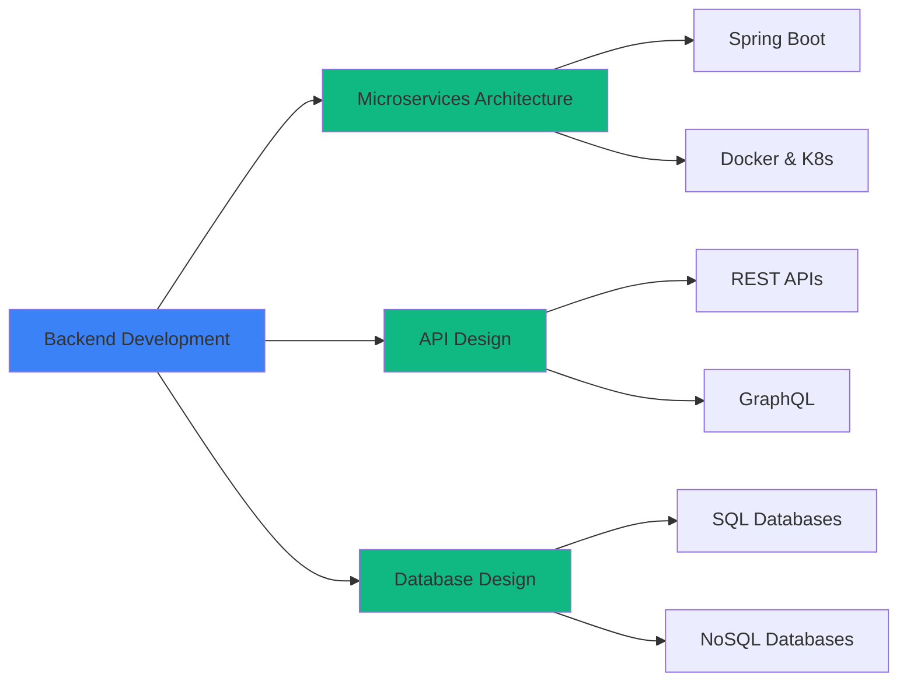

<div align="center">

# Deranindu Gunasekara

### Backend Architect | Microservices Specialist | Cloud Engineer


<br/>

[](mailto:deranindu@gmail.com)
[](https://codediaryofme.blogspot.com)
[](https://github.com/DeraniDU)

</div>

---

## 👨‍💻 About Me

> **Passionate Backend Developer specializing in scalable systems and modern architectures**

I build robust, production-ready backend systems using **Java**, **Spring Boot**, and **Node.js**. My focus is on creating scalable APIs, microservices architectures, and cloud-native solutions that drive business value.

```typescript
const deranindu = {
  role: "Backend Developer",
  expertise: ["Microservices", "API Development", "Cloud Architecture"],
  currentFocus: "Building scalable distributed systems",
  philosophy: "Continuous learning and systematic optimization",
  workingOn: "Cloud-native microservices with Kubernetes"
};
```

### 🎯 What I Do

- 🏗️ **Architect & Build** scalable backend systems and microservices
- ⚡ **Design & Develop** high-performance RESTful APIs
- ☁️ **Deploy & Optimize** cloud-native applications
- 🔄 **Implement** CI/CD pipelines and DevOps best practices

---

## 🛠️ Technology Stack

<table>
<tr>
  <td align="center" width="25%">
    <h3>Backend</h3>
    
    <br/>
    <sub><b>Java • Spring Boot</b></sub><br/>
    <sub><b>Node.js • Express</b></sub>
  </td>
  <td align="center" width="25%">
    <h3>Frontend</h3>
    
    <br/>
    <sub><b>React • Angular</b></sub><br/>
    <sub><b>JavaScript • TypeScript</b></sub>
  </td>
  <td align="center" width="25%">
    <h3>Database</h3>
    
    <br/>
    <sub><b>MongoDB • MySQL</b></sub><br/>
    <sub><b>PostgreSQL • Redis</b></sub>
  </td>
  <td align="center" width="25%">
    <h3>DevOps & Cloud</h3>
    
    <br/>
    <sub><b>Docker • Kubernetes</b></sub><br/>
    <sub><b>AWS • Git</b></sub>
  </td>
</tr>
</table>

---

## 📊 GitHub Analytics

<div align="center">
  <a href="https://github.com/DeraniDU">
    
  </a>
  <a href="https://github.com/DeraniDU">
    
  </a>
</div>

<br/>

<div align="center">
  <a href="https://github.com/DeraniDU">
    
  </a>
</div>

<br/>

<div align="center">
  <a href="https://github.com/DeraniDU">
    
  </a>
</div>

---

## 🚀 Featured Projects

<div align="center">

[](https://github.com/DeraniDU)
[](https://github.com/DeraniDU)

</div>

### 💡 Highlighted Work

| Project | Description | Tech Stack |
|---------|-------------|------------|
| **Microservice Architecture Template** | Production-ready template for building scalable microservices | Spring Boot, Docker, Kubernetes |
| **RESTful API Framework** | Custom framework with built-in security and monitoring | Node.js, Express, JWT |
| **MongoDB Data Pipeline** | Real-time data processing system | MongoDB, Kafka, Redis |
| **React Component Library** | Enterprise-grade component library | React, TypeScript, Storybook |

---

## 📈 Contribution Metrics

<div align="center">


<table>
  <tr>
    <td>
      
    </td>
    <td>
      
    </td>
  </tr>
  <tr>
    <td>
      
    </td>
    <td>
      
    </td>
  </tr>
</table>

</div>

---

## 🎓 Expertise Matrix



---

## 📝 Latest Blog Posts

<!-- BLOG-POST-LIST:START -->
- 🚀 Building Scalable Microservices with Spring Boot
- 🔧 Docker Best Practices for Production
- 📊 MongoDB Performance Optimization Techniques
- ⚡ RESTful API Design Patterns
<!-- BLOG-POST-LIST:END -->

➡️ [Read more on my blog](https://codediaryofme.blogspot.com)

---

## 🤝 Let's Connect

<div align="center">

I'm always interested in collaborating on innovative projects and discussing technology!

**💬 Ask me about:** React • Java • Spring Boot • MongoDB • Docker • API Development • Angular

**🌱 Currently exploring:** Cloud-native patterns • Advanced Kubernetes • System design

**📫 Reach out:** Drop me an email or connect through my blog!

<br/>

[](https://github.com/DeraniDU)
[](https://github.com/DeraniDU)

</div>

---

<div align="center">

### 💭 Developer Quote


### 🐍 Contribution Activity

To enable the snake animation, create a GitHub Actions workflow in your profile repository:
1. Create `.github/workflows/snake.yml` in your `DeraniDU/DeraniDU` repository
2. Use the platane/snk@v3 action to generate the snake contribution graph

---

<sub>⭐️ From [DeraniDU](https://github.com/DeraniDU) | Made with 💙 and ☕</sub>

</div>
